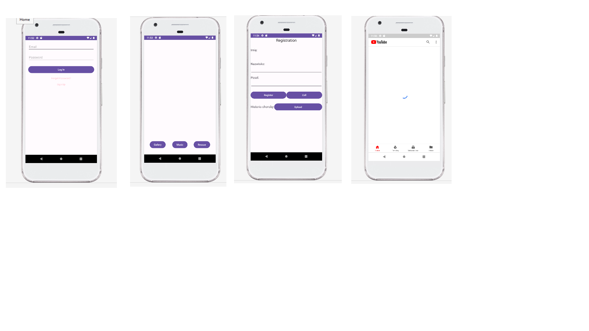

## Table of contents
* [General info](#general-info)
* [Technologies](#technologies)

## General info
Another Android application is designed to improve the quality of life that people spend at home during the COVID-19 epidemic.
It does so by reducing the level of frustration resulting from temporary isolation by relaxing. Its functionalities include music 
streaming and viewing mems placed in the cloud, and if necessary you can also call medical services. Of course, it is possible 
to individualize content by logging in to the application.
	
## Technologies
Project is created with:
* Java version: 17.0.5

